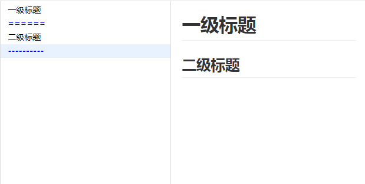
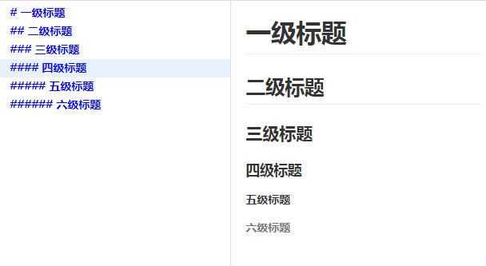
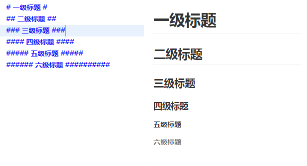

# 编写整洁优雅的Markdown
源码地址：[https://github.com/roc-mountain/Markdown](https://github.com/roc-mountain/Markdown)

## 目录

1. [目录](#page-tree)
2. [前言](#preface)
3. [什么是Markdown](#introduce)
4. [Markdown编写工具](#tool)
5. [Markdown语法](#syntax)
    * [5.1标题](#title)
6. [注意事项](#notice)

----

## 前言

项目中经常有一个被人们忽略的文件:`README.md`，通常情况都是简单的两句，并没有深入的了解一下这个文件的编写规则，今天仔细的探究了一下，把学习结果记录下来，与大家共勉。

## 什么是Markdown

Markdown的目标是成为一种适用于网络的书写语言，实现「易读易写」。可读性，无论如何，都是最重要的。   

一份使用 Markdown 格式撰写的文件应该可以直接以纯文本发布，并且看起来不会像是由许多标签或是格式指令所构成。    

Markdown 的语法受到一些既有 text-to-HTML 格式（包括 Setext、atx、Textile、reStructuredText、Grutatext 和 EtText）以及纯文本电子邮件的格式的影响，全由一些符号所组成，这些符号经过精挑细选，其作用一目了然。   

Markdown 的写法兼容HTML。需要注意HTML标签的类型：在 HTML 区块（块元素）标签间的 Markdown 格式语法将不会被处理（如：div,table,p）。HTML 的区段（行内元素）标签(如：span,a,img)可以在 Markdown 的段落、列表或是标题里随意使用。如果比较喜欢 HTML 的 `<a>` 或 `` 标签，可以直接使用这些标签，而不用 Markdown 提供的链接或是图像标签语法。  

通常情况下，用 Markdown 语法编写的文件的后缀名为`.md`。

## Markdown编写工具

一般代码编辑器都是可以满足编写 Markdown 语法文件的，并且有预览的功能，
本人尝试的有：[sublime](https://www.sublimetext.com) 和 [VScode](https://code.visualstudio.com/)。    
如果想要专业的Markdown编写工具，Mac系统推荐：[Mou](http://25.io/mou/)。Windows系统推荐：[MarkdownPad](http://www.markdownpad.com/)。  
在线编辑体验：<a href="https://roc-mountain.github.io/Markdown/editor.html" target="_blank">Markdown在线编辑体验</a>

## Markdown语法

### 标题
  Markdown 支持两种标题的语法，类 Setext 和类 atx 形式。

* 第一种类 Setext 形式是用底线的形式，利用 = （最高级标题）和 - （第二级标题），任何数量的 = 和 - 都可以有效果。例：

* 第二种类 Atx 形式则是在行首插入 1 到 6 个 # ，对应到标题 1 到 6 级，最高6级。例：

你可以选择性地在类 atx 样式的标题行尾加上 #，
而行尾的 # 数量不用和开头一样（行首的井字符数量决定标题的级数）。例：

## 注意事项

所有 Markdown 语法涉及到的符号，请在英文输入法下输入。
