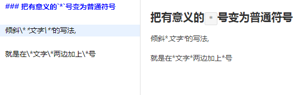

# 编写整洁优雅的Markdown
Markdown编写文档：[https://roc-mountain.github.io/Markdown/](https://roc-mountain.github.io/Markdown/ "Markdown编写文档")  
源码地址：[https://github.com/roc-mountain/Markdown](https://github.com/roc-mountain/Markdown "源码地址")  
在线体验：[https://roc-mountain.github.io/Markdown/editor.html](https://roc-mountain.github.io/Markdown/editor.html "在线体验")

## 1.目录

1. [目录](#1目录)
2. [前言](#2前言)
3. [什么是Markdown](#3什么是markdown)
4. [Markdown编写工具](#4markdown编写工具)
5. [Markdown语法](#5markdown语法)
    * [5.1标题](#51-标题)
    * [5.2段落和换行](#52-段落和换行)
    * [5.3列表](#53-列表)
    * [5.4引用注释](#54-引用注释)
    * [5.5代码区块](#55-代码区块)
    * [5.6分割线](#56-分割线)
    * [5.7强调](#57-强调)
    * [5.8链接](#58-链接)
    * [5.9图片](#59-图片)
    * [5.10符号](#510-符号)
6. [注意事项](#6注意事项)
7. [参考](#7参考)

----

## 2.前言

项目中经常有一个被人们忽略的文件:`README.md`，通常情况都是简单的两句，并没有深入的了解一下这个文件的编写规则，今天仔细的探究了一下，把学习结果记录下来，与大家共勉。

## 3.什么是Markdown

Markdown的目标是成为一种适用于网络的书写语言，实现「易读易写」。可读性，无论如何，都是最重要的。   

一份使用 Markdown 格式撰写的文件应该可以直接以纯文本发布，并且看起来不会像是由许多标签或是格式指令所构成。    

Markdown 的语法受到一些既有 text-to-HTML 格式（包括 Setext、atx、Textile、reStructuredText、Grutatext 和 EtText）以及纯文本电子邮件的格式的影响，全由一些符号所组成，这些符号经过精挑细选，其作用一目了然。   

Markdown 的写法兼容HTML。需要注意HTML标签的类型：在 HTML 区块（块元素）标签间的 Markdown 格式语法将不会被处理（如：div,table,p）。HTML 的区段（行内元素）标签(如：span,a,img)可以在 Markdown 的段落、列表或是标题里随意使用。如果比较喜欢 HTML 的 `<a>` 或 `` 标签，可以直接使用这些标签，而不用 Markdown 提供的链接或是图像标签语法。  

通常情况下，用 Markdown 语法编写的文件的后缀名为`.md`。

## 4.Markdown编写工具

一般代码编辑器都是可以满足编写 Markdown 语法文件的，并且有预览的功能，
本人尝试的有：<a href="https://www.sublimetext.com" target="_blank">sublime</a> 和 <a href="https://code.visualstudio.com/" target="_blank">VScode</a>。    
如果想要专业的Markdown编写工具，Mac系统推荐：<a href="http://25.io/mou/" target="_blank">Mou</a>。Windows系统推荐：<a href="http://www.markdownpad.com/" target="_blank">MarkdownPad</a>。  
在线编辑体验：<a href="https://roc-mountain.github.io/Markdown/editor.html" target="_blank">Markdown在线编辑体验</a>

## 5.Markdown语法

### 5.1-标题
  Markdown 支持两种标题的语法，类 Setext 和类 atx 形式。

* 第一种类 Setext 形式是用底线的形式，利用 = （最高级标题）和 - （第二级标题），任何数量的 = 和 - 都可以有效果。例：

  

* 第二种类 Atx 形式则是在行首插入 1 到 6 个 # ，对应到标题 1 到 6 级，最高6级。例：

  

  你可以选择性地在类 atx 样式的标题行尾加上 #，
  而行尾的 # 数量不用和开头一样（行首的井字符数量决定标题的级数）。例：

  

### 5.2-段落和换行

一个 Markdown 段落是由一个或多个连续的文本行组成，它的前后要有一个以上的空行（空行的定义是显示上看起来像是空的，便会被视为空行。比方说，若某一行只包含空格和制表符，则该行也会被视为空行）。Markdown 允许段落内的强迫换行（插入换行符），在换行处（插入处）先按入两个以上的空格然后按回车即可实现换行。（注：有些Markdown编辑器已经避免这个问题，需要换行的时候只需按入空格即可）

普通段落不该用空格或制表符来缩进。（空格缩进4个以上或一个制表符，会把缩进内容变为代码区块内容。详见：[5.5代码区块](#55-代码区块)）

### 5.3-列表

 Markdown 的列表有两种：无序列表和有序列表。

- 无序列表：使用星号（*）、加号（+）或是减号（-）作为列表标记。列表标记符号在每一行的第一位（最多允许缩进3个空格），后面有至少一个空格。例：

  

- 有序列表：数字接着一个英文句点(.)作为列表标记，任意数字开头加上英文句点都会形成有序列表。例：

  

### 5.4-引用注释

Markdown 标记区块引用注释是使用类似 email 中用 `>` 的引用方式。在每行的最前面加上`>`、或者在整个段落的第一行加上`>`。例：

  

### 5.5-代码区块

代码区块就是按照原来的样子显示那些和程序相关的写作或原始代码。  
单行的代码区块可以用反引号（\`）（通常在键盘Esc键的下方）在单行内容的前后包起来。  
多行的代码区块可以用三个反引号在多行内容的前后包起来、或者在每行内容的前边有四个空格缩进。例：

  

代码区块可以实现高亮，只需要在开始的三个反引号后边加上对应的语言。例：

  
  

### 5.6-分割线

在一行中用三个以上的星号、减号、底线来建立一个分隔线，行内不能有其他东西。例：

  

### 5.7-强调

强调有三种，倾斜、加粗和删除。  
倾斜用一个底线（_）或星号（*）包裹内容。  
加粗用两个底线（_）或星号（*）包裹内容。  
删除是用两个波浪号（~）包裹内容例：

  

### 5.8-链接

链接有两种写法：行内式和参考式。
行内式：
```
[链接文字](链接地址 "我是行内式描述")
```

参考式：
```
[链接文字][标记]
[标记]: 链接地址 "我是参考式描述"
```
（注：参考式标记可以放在整个文档的任何地方。描述是鼠标放在链接上的提示文字,描述不是必须项）
例：
  


### 5.9-图片

图片和[链接](#58-链接)的写法相似，只是在链接写法的前边加一个叹号（!）。例：

  

### 5.10-符号

Markdown 可以利用反斜杠来插入一些有语法意义的符号。例：

  

Markdown 支持以下这些符号前面加上反斜杠来变为普通的符号：
```
\   反斜线
`   反引号
*   星号
_   底线
{}  花括号
[]  方括号
()  括弧
#   井字号
+   加号
-   减号
.   英文句点
!   惊叹号
```

### 5.11-表格

Markdown 也可以制作表格，用分隔符（|）确定表格是几列，用换行确定是几行，用冒号（:）确定内容对齐方式（只有左侧有冒号-左对齐,只有右侧有冒号-右对齐，两侧都有冒号-居中）。例：

  

### 5.12-表情

Markdown 也支持在文字中插入表情，用两个冒号加上相应的单词比如：`:smile:`就是表情:smile:。更多表情可以查看[《表情列表》](https://github.com/roc-mountain/Markdown/blob/master/emoji.md)

## 6.注意事项

- 所有 Markdown 语法涉及到的符号，请在英文输入法下输入。
- 所有 Markdown 语法都可以嵌套使用，比如：列表套引用、引用的多层嵌套、引用内用标题，等等...
## 7.参考

Markdown 语法说明（简体中文版）：[http://wowubuntu.com/markdown/](http://wowubuntu.com/markdown/)  
Markdown 语法说明（英文版）：[https://daringfireball.net/projects/markdown/syntax](https://daringfireball.net/projects/markdown/syntax)  
